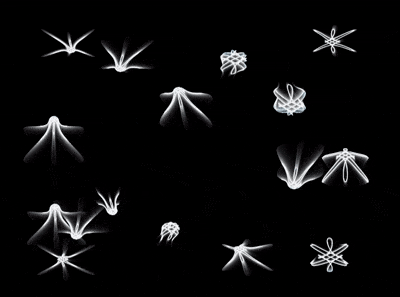

# C Jellyfish

A school of jellyfish rendered from a single closed-form parametric equation, in
C with [raylib](https://www.raylib.com/). Every tentacle, pulse and drift comes
out of six lines of trigonometry — there is no simulation, no particle system
and no geometry beyond one precomputed curve.



## What it is

A port of a short p5.js sketch (a "dweet") to C. The original packs the whole
animation into a couple hundred characters:

```js
a=(m,d=mag(k=9*cos(i*5)*sin(i),e=cos(i*3)*cos(i*2)*9)**3/1999+1.5-sin(t/2+m)**3/3)=>
  point(99*sin(c=d/16-t/48+m)+k*(p=d**sin(d*d-t+m))+200,99*sin(c*4)+e*p+200)
t=0,draw=$=>{t||createCanvas(w=400,w);background(9).stroke(w,96);
  for(t+=PI/20,i=1e4;i--;)a(i%16*13)}
```

Unrolled, each point is:

```
k = 9*cos(i*5)*sin(i)                     // the body curve, x
e = cos(i*3)*cos(i*2)*9                   // the body curve, y
d = mag(k,e)³/1999 + 1.5 - sin(t/2+m)³/3  // bell pulse
c = d/16 - t/48 + m                       // slow Lissajous drift
p = d ^ sin(d*d - t + m)                  // radial breathing
x = 99*sin(c)   + k*p
y = 99*sin(c*4) + e*p
```

`m` is the only thing separating one jellyfish from the next — 16 phase offsets,
13 radians apart, give 16 animals strung along the same drift path.

This version differs from the original in three ways:

- **Continuous sampling.** The original walks an integer index, which lands
  quasi-randomly along the curve and reads as a dotted scatter. Here the curve is
  sampled evenly and drawn as a connected polyline, so it survives being scaled
  up to fill the window. 1500 samples replace 10 000 scattered points.
- **A centring anchor.** The `99*sin(c)` terms swing each jellyfish over ~200
  units while its body is only ~40 units across. Evaluating those terms at the
  mean radius and subtracting the result pins the animal in place without
  flattening the spread they contribute to its silhouette.
- **Additive glow and trails.** Drawn into an offscreen buffer that fades rather
  than clears, at 2× resolution for anti-aliasing.

The animation loops exactly every `t = 96π` — 64 seconds — which is where `t/2`,
`t` and `t/48` all complete a whole number of cycles simultaneously.

## Building

Needs a C11 compiler and raylib 5.0 or newer.

```bash
brew install raylib          # macOS
sudo apt install libraylib-dev   # Debian/Ubuntu
```

Then:

```bash
make run
```

`make` alone builds `./jellyfish`; `make clean` removes it. If raylib is built
from source rather than installed by a package manager, point the build at it:

```bash
make RAYLIB_PATH=/path/to/raylib
```

The Makefile detects macOS vs Linux and links the right platform libraries. It
finds raylib through `pkg-config` when `RAYLIB_PATH` is not given.

## Controls

| Key | Action |
| --- | --- |
| `F` | Toggle between the free-swimming school and a single centred jellyfish |
| `SPACE` | Pause / resume |
| `R` | Restart the animation from `t = 0` |
| `S` | Save a screenshot to `jellyfish.png` in the working directory |
| `ESC` | Quit |

Time advances by `GetFrameTime()`, so the animation runs at the same wall-clock
speed regardless of frame rate — changing `TARGET_FPS` affects smoothness, not
speed.

## Tuning

The interesting constants are all at the top of [main.c](main.c):

| Constant | Effect |
| --- | --- |
| `JELLYFISH_COUNT` | How many animals in the school. The original uses 16 |
| `PHASE_STEP` | Radians between neighbours. 13 is the original's spacing |
| `CURVE_SAMPLE_COUNT` | Outline resolution. Lower is sketchier and cheaper |
| `VIEW_FILL_RATIO` | Fraction of the window the animation occupies |
| `SUPERSAMPLE_FACTOR` | Offscreen resolution multiplier. 1 disables it |
| `TRAIL_FADE_COLOR` | Alpha controls trail length — higher fades faster |
| `HALO_THICKNESS` / `CORE_THICKNESS` | Stroke weights, in world units |

`CENTERED_HALF_EXTENT` and `DRIFT_AMPLITUDE` are measured properties of the
formula rather than preferences. Together they bound the shape at any follow
strength, which is what keeps the school inside the window when it spreads out.
